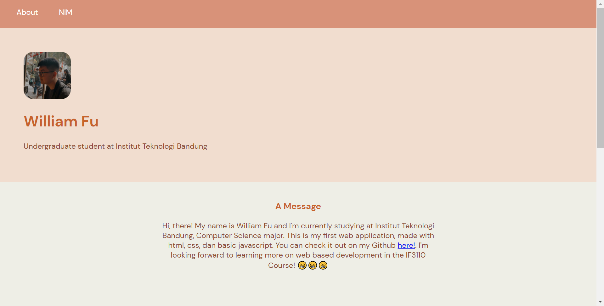

## Tugas Individu - IF3110 Pengembangan Berbasis Web

### Identitas Diri
William Fu

13518055 (K2)

### About
Tugas Belajar Mandiri - IF3110 Pengembangan Aplikasi Berbasis Web. Membuat satu halaman web dengan menggunakan HTML, CSS, dan Javascript sederhana yang menampilkan informasi tentang diri Anda, misal profile page, blog cover page, dsb.

### Running The App
Buka file index.html pada web browser anda

### Screenshot Aplikasi

### Referensi
- Materi kuliah IF3110 Pengembangan Berbasis Web
- w3schools.com